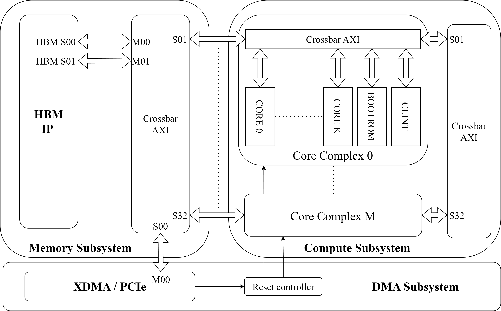

# RISCV core Cluster

This repository hosts the hardware and software for a RISCV core cluster, developed as part of my master thesis project.
It is based on the work of the PULP project, a joint effort between ETH Zurich and the University of Bologna.

# Repository organization

## bootrom_u55
Contains initialization code for the riscv cores, compiled into an rtl bootrom and the relative compile scripts

## hw
Contains all the hardware related to the compute platform: cores, peripherals, interfaces and AXI primitives, from the PULP project. Import in your new project only the needed files.

## sw
Contains the riscv test executable and the crosscompile toolchain. As well as the scripts to instantiate an XDMA/HBM only interface with a step by step guide.

## tcl-scripts
Start from here to build a new projects based on this design.

Scripts to instantiate the HBM and DMA subsystems to be connected to the compute platform, with a guide.

## xdc
Alveo U55c hardware constraint

# HOW TO USE THIS REPO:
- create a new vivado project for alveo u55c
- import all the rtl files in HW and the bootrom in bootrom_u55
- import xdc
- run tcl/clock_gen.tcl and tcl/qdma_interface.tcl
- implement or simulate the design
